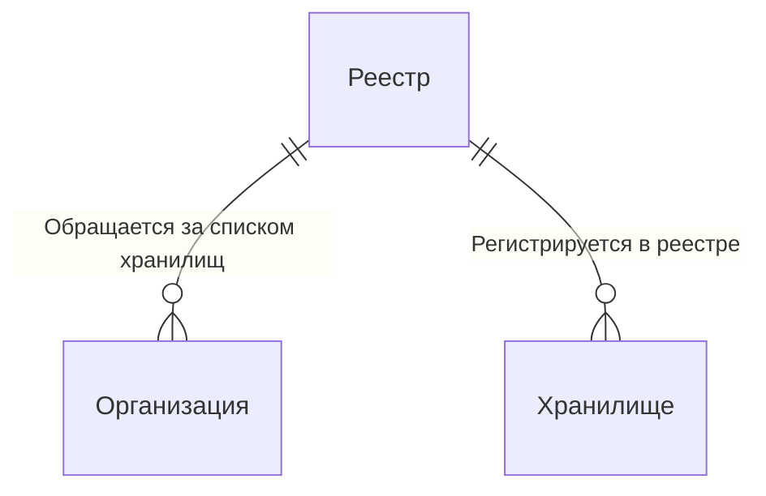

# Garbage collector

## Описание

Cистема учета отходов, состоящая из трех сущностей:

1. Реестра - хранит информацию о хранилищах

2. Хранилища - хранит отходы. Конкретное хранилище хранит определенные типы отходов с определенными ограничениями.

3. Организации - производит отходы.


### Отношения между сущностями



С деталями реализаций и описанием основных эндпоинтов можно ознакомиться здесь: [Impl.md](./src/Impl.md).

## Запуск

### Нативный запуск

Требования: `python 3.12` и `poetry`.

Создание окружения и установка зависимостей:

```bash
python3 -m venv .venv
poetry shell
poetry install
```

Запустить сервер можно с помощью команды:
```bash
uvicorn 'registry.main:app' --host 0.0.0.0 --port 8800
```

Это пример для запуска экземпляра реестра. Для запуска хранилища или организации замените `registry` на `collector` или `producer` соответственно.
Также необходимо учесть, что для работоспособности хранилища и организации нужно присвоить значения некоторым переменным окружения - все они указаны в [Impl.md](./src/Impl.md).

### Запуск с помощью Docker

Требования: `Docker`.

Соберите образ:

```bash
docker build . --tag gc
```

Запуск на примере сервиса хранилища (должен быть запущен сервис реестра):

```bash
docker run -d --publish 8801:8801 \
    -e COLLECTOR_DB_URI=sqlite:///sqlite.db \
    -e COLLECTOR_SELF_URL=http://0.0.0.0:8801 \
    -e COLLECTOR_REGISTRY_URL=http://registry:8800 \
    -e COLLECTOR_POSITION_X=0 \
    -e COLLECTOR_POSITION_Y=1 \
    gc:latest uvicorn --host 0.0.0.0 --port 8801 'collector.main:app'
```

### Запуск с помощью Docker compose

Файл [`compose.yml`](./compose.yml) описывает один реестр, три хранилища и одну организацию.

Запустить можно с помощью команды:
```bash
docker compose up -d --build
```

Реестр будет доступен на порту 8800. Хранилища - на портах 8801, 8802 и 8803. Организация - на порту 8880.

## Документация

Доступ к документации эндпоинтов можно получить, обратившись в браузере к ресурсам /docs или /redoc. Это справедливо для каждого из сервисов.

Например, для получения документации к хранилищу запустите сервисы с помощью `docker compose up -d --build` и обратитесь в браузерной строке по адресу `http://localhost:8801/docs`.

## Тестирование

Реализованы тесты для каждого из сервисов - все они располагаются в директории [tests](./tests/).

Для запуска выполните команду:
```bash
pytest tests
```

*Внимание*: для работоспособности тестов порты 8800 и 8801 должны быть свободны, а также не должно быть docker сети с именем `gcn`.